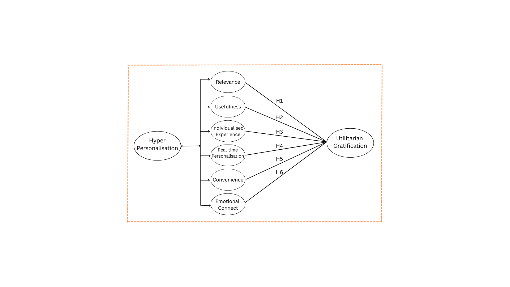

# AI-Driven Hyper-Personalization and Customer Value Analysis

> A research project examining how AI-driven hyper-personalization influences customer value gratification among digital consumers using survey research and Structural Equation Modelling (SEM).

---

## Overview

As organizations increasingly leverage AI to deliver personalized customer experiences, understanding what truly creates value for customers has become essential. This project investigates how different dimensions of hyper-personalization influence customer value gratification in digital environments.

The study applies Structural Equation Modelling (SEM) to analyze consumer perceptions and identify the factors that contribute most significantly to customer value. Beyond statistical analysis, the research provides practical business insights that can help organizations design more customer-centric personalization strategies.

---

## Research Objectives

- Examine the impact of AI-driven hyper-personalization on customer value gratification.
- Evaluate six key dimensions of hyper-personalization from the customer's perspective.
- Identify which personalization factors contribute most significantly to customer value.
- Generate actionable business insights for improving customer experience and engagement.

---

## Research Framework

The conceptual framework examines the relationship between six dimensions of hyper-personalization and customer value gratification.

<p align="center">

</p>

---

## Methodology

| Category | Details |
|----------|---------|
| Research Design | Quantitative Cross-sectional Study |
| Sample Size | 135 Digital Consumers |
| Data Collection | Online Survey (Google Forms) |
| Target Audience | Indian Digital Consumers |
| Measurement Scale | 5-Point Likert Scale |
| Analysis Technique | Structural Equation Modelling (SEM) |
| Statistical Tools | SPSS, AMOS |

---

## Variables Studied

### Independent Variables

- Relevance
- Usefulness
- Individualized Experience
- Real-Time Personalization
- Emotional Connect
- Convenience

### Dependent Variable

- Utilitarian Gratification (Customer Value)

---

## Key Findings

The research revealed several important insights into customer perceptions of AI-driven personalization.

- Emotional Connect emerged as the strongest contributor to customer value gratification.
- Functional personalization factors such as relevance, usefulness, convenience, and real-time personalization were not statistically significant in influencing customer value independently.
- Customers increasingly perceive functional personalization as a baseline expectation rather than a differentiating factor.
- Emotional resonance plays a more influential role than system efficiency in shaping customer perceptions of value.

---

## Business Insights

This research highlights several implications for organizations implementing personalization strategies.

- Personalization should extend beyond product recommendations and focus on building meaningful customer relationships.
- Emotional engagement is a stronger driver of perceived customer value than purely functional personalization.
- Organizations should combine AI-driven personalization with empathetic communication to enhance customer satisfaction.
- Delivering customer value requires balancing automation with human-centric experiences.

These findings are particularly relevant for Customer Success, Customer Experience, CRM, Product, and Digital Marketing teams seeking to improve customer engagement and long-term retention.

---

## Skills Demonstrated

### Research & Analytics

- Research Design
- Survey Design
- Consumer Behaviour Analysis
- Customer Research
- Statistical Analysis
- Structural Equation Modelling (SEM)
- Hypothesis Testing
- Data Interpretation

### Business Skills

- Customer Experience Analysis
- Customer Insights
- AI in Marketing
- Digital Marketing Research
- Customer Value Analysis
- Business Recommendation Development
- Insight Generation

### Tools

- SPSS
- AMOS
- Microsoft Excel
- Google Forms

---

## Repository Structure

```
hyper-personalization-customer-value-analysis/

│
├── Assets/
│   └── Conceptual_Framework.png
│
├── Dataset/
│   └── Hyper_Personalization_Survey_Dataset.xlsx
│
├── Questionnaire/
│   └── Hyper_Personalization_Questionnaire.pdf
│
├── Report/
│   └── AI_Driven_Hyper_Personalization_Customer_Value_Research.pdf
│
├── LICENSE
└── README.md
```

---

## Future Scope

Potential extensions of this research include:

- Industry-specific personalization studies
- Cross-country consumer comparisons
- Longitudinal analysis of customer perceptions
- Integration of trust and privacy constructs
- AI-powered recommendation effectiveness across industries

---

## About This Project

This project was conducted to understand how AI-driven personalization influences customer value in digital environments. It combines academic research methods with business-focused interpretation to generate insights that can support customer-centric decision-making.
